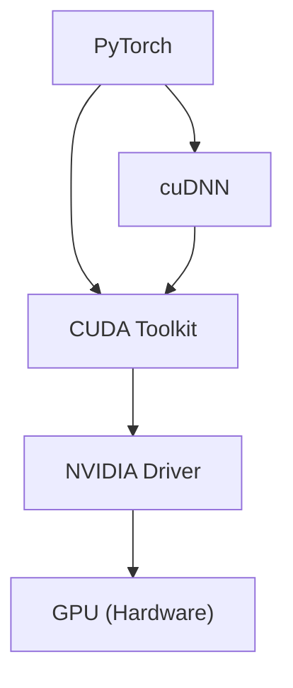

:::note
When using the provided server, everything including the driver and CUDA toolkit is already installed, so you might not need to worry about these details initially. However, I strongly encourage you to understand these concepts because you might one day need to maintain your own server (though hopefully you won't have to).
:::

## Introduction

Back in the day, I always wondered why we could run PyTorch code on our local machine without a GPU, but when it came to compiling or training local library, we suddenly needed CUDA toolkit. What's going on under the hood?

In this article, we’ll break down the mystery behind CUDA, cuDNN, and all the other buzzwords. By the end, you’ll have a clearer (and hopefully less intimidating) understanding of how they all fit together.

<!-- truncate -->

:::warning
This article will not walk you through the installation of these components.
:::

## Crash the Terminology

Before we dive into how everything connects, let’s quickly introduce the key players. You might already be familiar with some of them!

* **Driver**: Think of it as a "bridge" that helps your system talk to the GPU. Without it, your GPU would just sit there, looking pretty but doing nothing.
* **PyTorch**: A popular deep learning framework in Python. It makes building and training neural networks a breeze.
* **CUDA toolkit**: A set of tools, libraries, and a compiler that helps you write code to run on NVIDIA GPUs. Basically, it’s what makes your GPU do the heavy lifting.
* **cuDNN**: A specialized library built on top of CUDA, designed to make deep learning operations (like convolutions) super fast and efficient.



## Relation Between CUDA and Driver

When you run `nvidia-smi`, you might see something like this:

```plaintext
+-----------------------------------------------------------------------------------------+
| NVIDIA-SMI 570.86.15              Driver Version: 570.86.15      CUDA Version: 12.8     |
|-----------------------------------------+------------------------+----------------------+
| GPU  Name                 Persistence-M | Bus-Id          Disp.A | Volatile Uncorr. ECC |
| Fan  Temp   Perf          Pwr:Usage/Cap |           Memory-Usage | GPU-Util  Compute M. |
|                                         |                        |               MIG M. |
|=========================================+========================+======================|
|   0  NVIDIA H100 NVL                Off |   00000000:0A:00.0 Off |                    0 |
| N/A   49C    P0             98W /  400W |   17258MiB /  95830MiB |      0%      Default |
|                                         |                        |             Disabled |
+-----------------------------------------+------------------------+----------------------+
|   1  NVIDIA H100 NVL                Off |   00000000:0D:00.0 Off |                    0 |
| N/A   41C    P0             63W /  400W |       4MiB /  95830MiB |      0%      Default |
|                                         |                        |             Disabled |
+-----------------------------------------+------------------------+----------------------+
...
```

At this point, you might ask yourself:

* What does this "CUDA Version" actually mean?
* Does this mean I have CUDA 12.8 installed on my system?

Before answering, let’s clear up the difference between **CUDA** and the **CUDA Toolkit**.

When we say *CUDA*, it often refers to the whole platform that allows us to run GPU-accelerated code — including the drivers, libraries, and development tools. The **CUDA Toolkit**, on the other hand, is part of the *CUDA* platform.

Inside CUDA, there are two main APIs:

1. **Driver API**: Lower-level, gives you fine-grained control.
2. **Runtime API**: Higher-level, easier to use, and most user code (like PyTorch) depends on this.

Now, the **CUDA Version** shown in `nvidia-smi` refers to the **maximum CUDA runtime version supported by your installed driver** (essentially, what your driver can handle). It doesn’t necessarily mean you have that version of the CUDA Toolkit installed.

So, does this mean you have CUDA 12.8 installed? The answer is: *kind of, but not really*.

* **Yes**, because your driver supports CUDA 12.8 through its driver API.
* **No**, because to actually compile and run your own GPU programs (e.g., custom CUDA kernels), you still need to install the CUDA Toolkit, which includes the runtime libraries, compiler (`nvcc`), and other development tools.

That’s why you often still need to install a specific CUDA Toolkit version on your system, even if your driver "supports" a higher CUDA version.

## Multiple CUDA Toolkit Versions

As we mentioned earlier, the CUDA Toolkit is basically just a set of libraries and tools. Because of that, you can actually install **multiple versions** of the toolkit on the same machine without much trouble!

The only thing you need to do is tell your programs which version you want them to use. That’s why you’ll often see instructions or articles asking you to set environment variables like `CUDA_HOME`, `LD_LIBRARY_PATH`, and add the CUDA binaries to your `PATH`.

Here’s an example of how you might do it:

```bash
CUDA_VERSION=12.4

CUDA_HOME="/usr/local/cuda-${CUDA_VERSION}"
PATH=$PATH:"/usr/local/cuda-${CUDA_VERSION}/bin"
LD_LIBRARY_PATH="/usr/local/cuda-${CUDA_VERSION}/lib64"
LIBRARY_PATH="/usr/local/cuda-${CUDA_VERSION}/lib64"
```

This way, you can switch between different CUDA versions depending on which one your project needs — super handy if you’re working on multiple projects or need to match different library requirements.

By the way, CUDA toolkits are usually installed under `/usr/local`. You can take a peek by running:

```bash
ls /usr/local
```

If you've installed CUDA before, you’ll probably see directories like `cuda-11.8`, `cuda-12.4`, and so on.

## CUDA Toolkit and PyTorch

Remember that question:

> Why don’t we need to install the CUDA Toolkit separately when using PyTorch?

Well, the short answer is: **we actually do need CUDA libraries for PyTorch**, but when you install PyTorch using `pip` or `conda`, they handle it for you behind the scenes.

In fact, when you install PyTorch this way, it comes bundled with the specific CUDA libraries it needs to run on your GPU. For example, if you install via `pip`, you’ll also get packages like:

* `nvidia-cublas-cuxx`
* `nvidia-cuda-runtime-cuxx`
* `nvidia-cudnn-cuxx`

Here, the "xx" represents the specific CUDA version (e.g., `cu118` for CUDA 11.8).

It’s important to note that these are **just the necessary libraries**, not the full CUDA Toolkit. The libraries come as [**shared objects**](https://dmerej.info/blog/post/symlinks-and-so-files-on-linux/) (e.g., `.so` files on Linux, `.dll` files on Windows). This means they are pre-compiled and dynamically linked at runtime, so you don’t need to compile them yourself.

If you’re curious and want to see them yourself, you can find these files under something like `{PATH_TO_PYTHON}/lib/python3.{VERSION}/site-packages/torch/lib`.

That’s why you can get GPU acceleration in PyTorch without manually installing the full toolkit — the heavy lifting is already packaged for you!

## CUDA Toolkit — Useful or Not?

You might ask: *So... do I actually need to install the CUDA Toolkit?*

Well, if you’re just using PyTorch as-is (and installing it via `pip` or `conda`), you **don’t** need to install the CUDA Toolkit manually.

However, if you want to use third-party [custom CUDA extensions](https://docs.pytorch.org/tutorials/advanced/cpp_extension.html) — for example, if you need a super-fast deformable attention module in DETR — you’ll need to **manually compile** the `.cu` files. In this case, having the CUDA Toolkit (which includes the compiler `nvcc`) is essential.

When compiling your own CUDA code, it’s important to make sure the **CUDA Toolkit version** matches the version PyTorch expects. There’s also the concept of **Compute Capability (CC)** — which basically describes the GPU architecture version.

If you compile your code for an older CC, it can usually still run on newer GPUs. But if you compile for a newer CC, it might not run on older GPUs.

If you want to support multiple GPUs, you can set the `TORCH_CUDA_ARCH_LIST` environment variable when compiling. For example, if you want to support both an RTX 3090 (`sm_86`) and an H100 (`sm_90`), you can do:

```bash
TORCH_CUDA_ARCH_LIST="86 90"
```

Interestingly, if you don’t set `TORCH_CUDA_ARCH_LIST`, PyTorch will automatically use the architectures it detects from the GPUs visible during build. It also includes a `+PTX` option, which allows the code to run on future GPUs with higher CCs.

Here’s a note from the [PyTorch docs](https://docs.pytorch.org/docs/stable/cpp_extension.html) that explains this nicely:

> "By default the extension will be compiled to run on all archs of the cards visible during the building process of the extension, plus PTX. ... The +PTX option causes extension kernel binaries to include PTX instructions for the specified CC. PTX is an intermediate representation that allows kernels to runtime-compile for any CC ≥ the specified CC (for example, 8.6+PTX generates PTX that can runtime-compile for any GPU with CC ≥ 8.6)."

## Conclusion

That’s it! We’ve untangled the web of CUDA, cuDNN, drivers, toolkits, and how they all play together with PyTorch.

To sum it up: if you're just running PyTorch out of the box, you don’t have to worry too much — most of the magic is handled for you behind the scenes. But once you start diving into custom CUDA code or advanced optimizations, knowing how all these pieces fit together becomes super important (and actually pretty fun!).

Hopefully, this article helped clear up the mystery and gave you a deeper appreciation for what’s happening under the hood when your GPU starts humming along.
