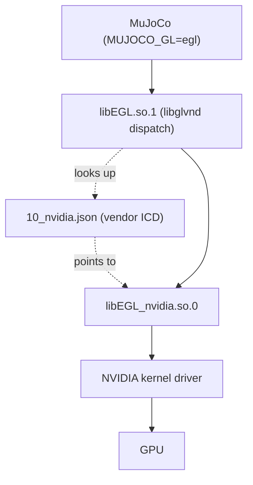

You SSH into the server, activate your environment, and run the training script that renders a few evaluation videos. Everything worked perfectly on your laptop. Here, you get something like this:

```plaintext
mujoco.FatalError: gladLoadGL error
```

or, if you are slightly luckier:

```plaintext
RuntimeError: Failed to initialize EGL display
```

No GPU is broken. Your driver is fine — `nvidia-smi` prints a beautiful table. The problem is that MuJoCo wants to render **headlessly**, and the one small piece of the driver it needs for that is missing from the system. The annoying part is that fixing it normally requires `sudo`, which you probably do not have on a shared machine.

Good news: you *can* fix it from your own home directory. This post explains why the error happens and walks through the workaround.

<!-- truncate -->

:::note
This guide targets Linux servers with an NVIDIA GPU and no display attached. If you are on your own desktop with a monitor plugged in, you very likely do not need any of this.
:::

---

## Why It Breaks

On a machine with a monitor, OpenGL talks to an X server, and everything just works. On a headless server there is no X server, so MuJoCo falls back to **EGL**, an interface that lets you get an OpenGL context straight from the GPU with no window system involved. That is what `MUJOCO_GL=egl` selects.

EGL on Linux is not a single library. It uses a dispatch layer called **libglvnd**, which acts like a receptionist: your program calls `libEGL.so.1`, and libglvnd figures out *which vendor* should actually handle the call and forwards it there. To do that, it needs two things:

1. **A vendor ICD file** — a small JSON file (conventionally `/usr/share/glvnd/egl_vendor.d/10_nvidia.json`) that says "NVIDIA's EGL implementation lives in this library".
2. **The vendor library itself** — `libEGL_nvidia.so.0`, part of the NVIDIA driver's user-space side.



Plenty of servers are installed with a compute-only driver package, which ships CUDA but skips the graphics bits. The kernel module is there — that is why `nvidia-smi` works — but the EGL vendor library and its ICD file never got installed. libglvnd then has no vendor to dispatch to, and MuJoCo dies at context creation.

The fix is to supply those two files ourselves. Both are pure user-space, so neither needs root.

---

## Step 1: Grab the Matching Driver Package

The user-space libraries must match the **exact version** of the kernel driver already loaded. Check yours first:

```bash
nvidia-smi --query-gpu=driver_version --format=csv,noheader
# or
cat /proc/driver/nvidia/version
```

:::warning
Version matching is not optional here. A `550.x` user-space library talking to a `570.x` kernel module will fail, often with a confusing error that looks nothing like a version mismatch. Use the number you just printed.
:::

Then download the matching `.run` installer from [NVIDIA's driver archive](https://download.nvidia.com/XFree86/Linux-x86_64) and **extract** it. Extracting is not installing — it only unpacks the archive into a directory, so it is completely safe to do as a normal user:

```bash
# Run this from your home directory. Replace xxx.xx.xx with your driver version.
cd ~
wget https://download.nvidia.com/XFree86/Linux-x86_64/xxx.xx.xx/NVIDIA-Linux-x86_64-xxx.xx.xx.run
sh NVIDIA-Linux-x86_64-xxx.xx.xx.run --extract-only
cd NVIDIA-Linux-x86_64-xxx.xx.xx
```

Inside you will find the real library, named with its full version. libglvnd will look for the *soname* `libEGL_nvidia.so.0`, so create that link:

```bash
ln -s libEGL_nvidia.so.xxx.xx.xx libEGL_nvidia.so.0
```

---

## Step 2: Put the Library on the Search Path

The loader needs to find `libEGL_nvidia.so.0` at runtime. Add the extracted directory to `LD_LIBRARY_PATH` in your `~/.zshrc` or `~/.bashrc`:

```bash
export LD_LIBRARY_PATH="$LD_LIBRARY_PATH:$HOME/NVIDIA-Linux-x86_64-xxx.xx.xx"
```

:::tip
`LD_LIBRARY_PATH` and `LIBRARY_PATH` are easy to mix up. `LIBRARY_PATH` is used by the **compiler** when linking a program; `LD_LIBRARY_PATH` is used by the **dynamic loader** when running one. libglvnd `dlopen`s the vendor library at runtime, so `LD_LIBRARY_PATH` is the one that matters.
:::

---

## Step 3: Write Your Own Vendor ICD File

Now tell libglvnd that this library exists. Create a `10_nvidia.json` anywhere you like — your home directory is fine:

```json
{
    "file_format_version" : "1.0.0",
    "ICD" : {
        "library_path" : "libEGL_nvidia.so.0"
    }
}
```

Normally libglvnd scans `/usr/share/glvnd/egl_vendor.d/` for these files, and we cannot write there. Luckily it also honours an environment variable that overrides the search entirely. Add this to your shell config as well:

```bash
export __EGL_VENDOR_LIBRARY_FILENAMES=/path/to/10_nvidia.json
```

:::note
The double underscore prefix is part of the name — `__EGL_VENDOR_LIBRARY_FILENAMES`, not `_EGL_...`. It accepts a colon-separated list of files, and it **replaces** the default directory scan rather than adding to it. If the system does have other working vendors you care about, list them too.
:::

Note that `library_path` is a bare filename rather than an absolute path. That is deliberate: it makes the loader resolve it through `LD_LIBRARY_PATH`, which is exactly what we set up in the previous step. An absolute path works too if you prefer to be explicit.

---

## Step 4: Device Permissions (Needs an Admin)

Rendering touches the GPU device nodes directly, and those are typically owned by the `video` and `render` groups. If your account is not in them, you will get a permission error even with everything above configured correctly.

This one genuinely needs root, so it is the part to hand to whoever administers the machine:

```bash
sudo usermod -aG video $USER
sudo usermod -aG render $USER
```

Group membership is only picked up at login, so **log out and back in** afterwards. Check with:

```bash
groups
ls -l /dev/dri/
```

---

## Verify It Works

Open a fresh shell so the new environment variables are picked up, then:

```bash
MUJOCO_GL=egl python -c "
import mujoco
model = mujoco.MjModel.from_xml_string('<mujoco><worldbody><geom type=\"sphere\" size=\".1\"/></worldbody></mujoco>')
data = mujoco.MjData(model)
renderer = mujoco.Renderer(model, 240, 320)
renderer.update_scene(data)
print('rendered frame:', renderer.render().shape)
"
```

If you see `rendered frame: (240, 320, 3)`, you are done. Set `MUJOCO_GL=egl` in your shell config so you do not have to remember it every time.

Still failing? Work through it in order:

* `echo $LD_LIBRARY_PATH` and confirm the extracted directory is really in there.
* `ls -l $HOME/NVIDIA-Linux-x86_64-*/libEGL_nvidia.so.0` — a dangling symlink usually means a typo in the version number.
* `cat $__EGL_VENDOR_LIBRARY_FILENAMES` — if this prints nothing, the variable is unset or the path is wrong.
* `groups | grep -E 'video|render'` — if empty, Step 4 has not taken effect yet.

The same trick applies well beyond MuJoCo — any headless EGL renderer (PyOpenGL, Isaac-style simulators, `nvdiffrast`) hits the same wall and takes the same fix.
