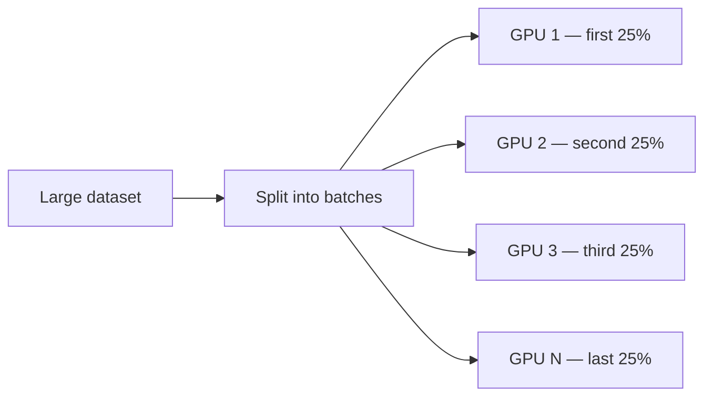
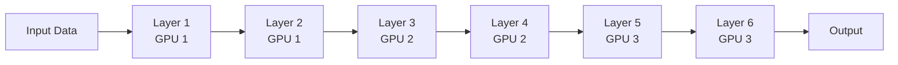
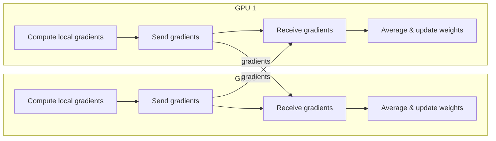

:::note
This tutorial assumes you already know the basics of PyTorch and how to train a model.
:::

## Why Do We Even Need Multiple GPUs?

These days, training big neural networks is like trying to stuff an elephant into a suitcase — it just doesn’t fit!

As datasets and models keep getting bigger and bigger, a single GPU often can’t handle the memory requirements, or it’s just painfully slow. That’s where using multiple GPUs swoops in to save the day.

<!-- truncate -->

## Motivation Examples

### Example 1: Huge Datasets

Let’s say you’re training an image classifier on a massive dataset like ImageNet. On a single GPU, each epoch might take several hours. If you have to train for 90 epochs… well, go ahead and schedule your vacation.

By splitting your data across multiple GPUs, each GPU processes a chunk of the batch in parallel. This slashes your epoch time and lets you experiment and iterate way faster.

### Example 2: Giant Models

Some newer models — think GPT-style transformers, diffusion models, or fancy vision-language models — are so big they can’t even fit on one GPU.

In this case, you can split the model itself across GPUs (this is called model parallelism). Now you can explore mega-scale architectures without hitting memory walls.

## How Do GPUs Talk to Each Other?

When you use multiple GPUs, they can’t just do their own thing in a vacuum — they need to talk to each other to stay on the same page (or, well, same weights).

Let’s break it down in a chill way.

### Example: Gradient Synchronization

In data parallelism, each GPU gets a different chunk of data and computes its own gradients. But to keep the model consistent, all GPUs need to share these gradients and average them before updating the weights.

This is usually done via a process called all-reduce:
 • Each GPU shares its gradients with all the others.
 • They collectively compute the average (or sum).
 • Then, each GPU updates its own weights using this averaged gradient.

This way, all GPUs end up with the same updated model after each training step — nice and synchronized.

## Communication Backends

To make all this gradient gossip happen fast, we rely on specialized communication libraries:

* **NCCL**: NVIDIA’s go-to library for super-fast GPU-to-GPU comms. It’s the default in PyTorch when using NVIDIA GPUs.
* **Gloo**: A general-purpose library that works for both CPU and GPU, often used in mixed setups.
* **MPI**: Popular in traditional high-performance computing, but less common in deep learning land.

:::tip
The actual speed of communication depends on how your GPUs are connected!
:::

* **PCIe**: Most common, decent speed, but can bottleneck with large models or batches.
* **NVLink**: Much faster, allows GPUs to share data more directly (almost like telepathy for GPUs).

For example, on NVIDIA H100 GPUs:

* PCIe Gen5: ~128 GB/s
* NVLink: up to ~900 GB/s

## Conclusion

Whether you’re trying to speed up training on massive datasets, fit gigantic models into memory, or just flex all those shiny GPUs sitting in your server rack, understanding how GPUs work together is a total game changer.

Just remember:

* GPUs don’t like working alone — they need to sync and share.
* Communication is key (just like in any good team).
* The right setup can save you tons of time (and maybe even your sanity).
